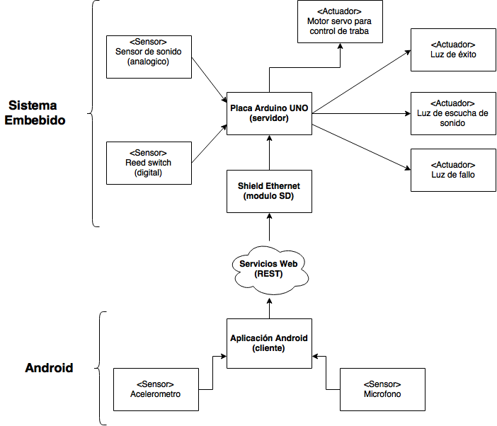
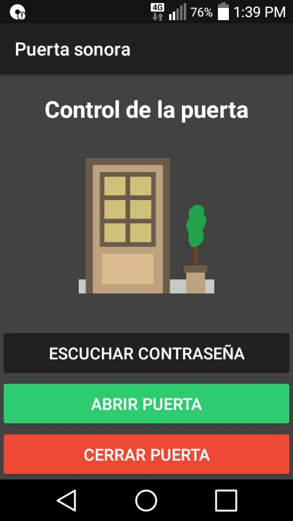
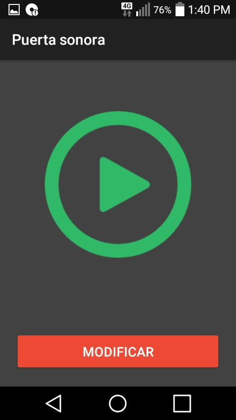
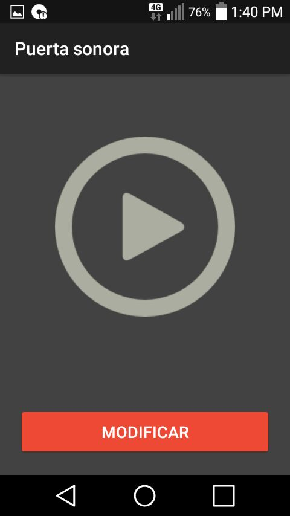
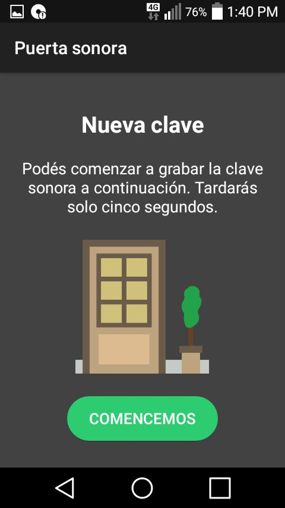
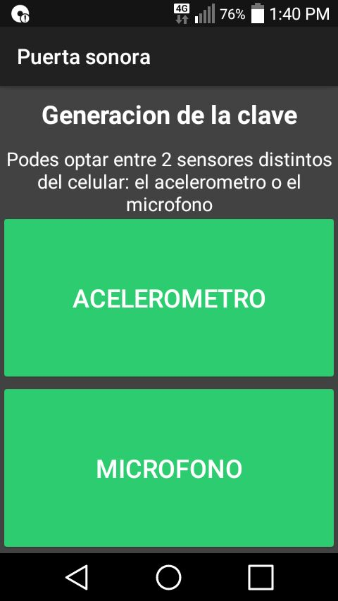
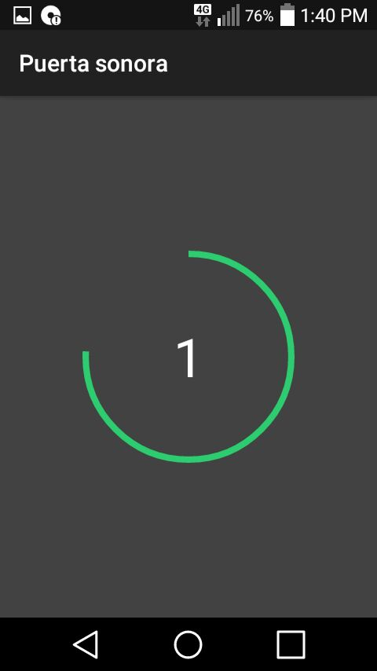
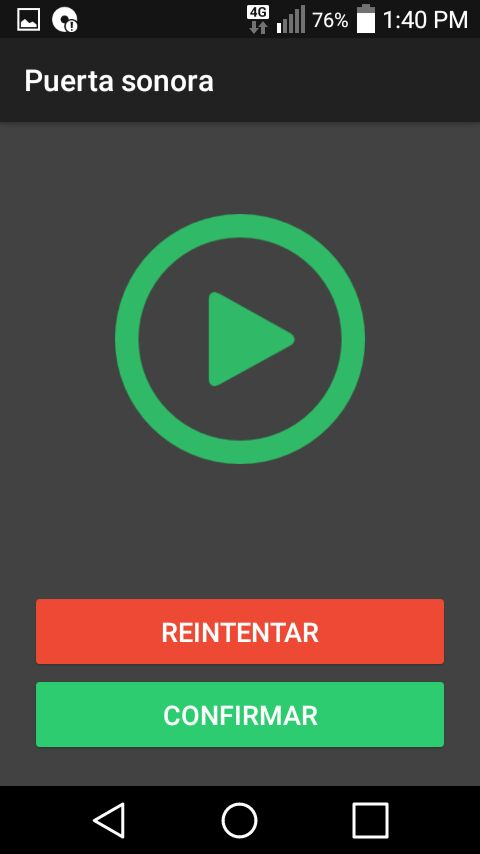

# PUERCOS - Aplicacion Android
Aplicación Android de la Puerta con Reconocimiento de código sonoro.

## Objetivo

Desarrollar un sistema de apertura/cerradura para una puerta mediante la deteccion de sonidos (palmadas o golpes en la misma puerta), de tal manera que la puerta se abra cuando el sistema, no solamente detecte la cantidad de sonidos especifica sino tambien se respete el tiempo entre cada sonido, como si fuera un codigo. Desde una aplicacion para android se podra cambiar ese codigo, ademas de abrir y cerrar la cerradura de la puerta. 

## Hardware Utilizado

* Dispositivos con Android a partir de la versión 4.03 (LG con Android 5.0.1)

## Software Utilizado

* Android Studio 2.2 para MacOS

## Implementación

Para la parte de Android, se desarrolló una aplicación que permite la grabación de la contraseña sonora requerida por el sistema embebido para la apertura de la cerradura de la puerta.
La funcionalidad principal de la aplicación consiste en un lapso de cinco segundos en donde el usuario puede grabar la contraseña que desee para la apertura de la cerradura.  Al usuario se le ofrecen dos alternativas para la grabación de dicha contraseña: 
La primer alternativa traduce una serie de movimientos bruscos del dispositivo realizados por el usuario en un patrón sonoro, que luego es codificado y enviado a la placa Arduino. Para brindar esta funcionalidad, utilizamos el acelerómetro.
Análogamente, el usuario puede obtener el mismo resultando grabando audio por medio del micrófono. Internamente la aplicación reconoce los sonidos de mayor intensidad del audio a medida que es grabado (golpes, aplausos, etc) y genera un patrón sonoro utilizando la misma lógica de la funcionalidad descrita anteriormente.

## Capturas de pantalla

## Demostración

Existe una demostración del uso del sistema en youtube [Aquí](https://)

## Nosotros somos

* Fernando Martín Ortiz. ortizfernandomartin@gmail.com
* Nahuel Roldán. nahu.jose.roldan1990@gmail.com
* Agustín Emmanuel Bravo. agusbravolg@gmail.com
